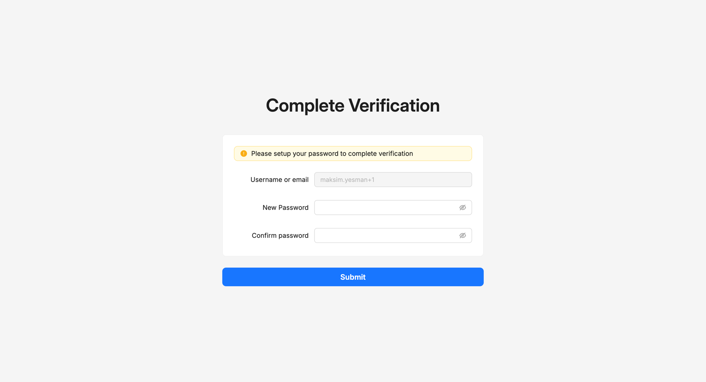
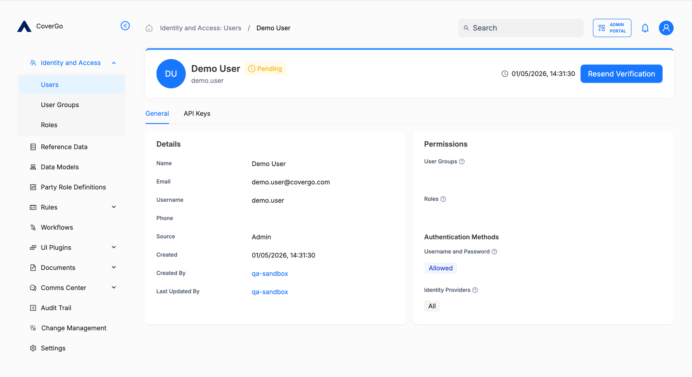

# Activate your account

When an administrator creates a new account for you, the account starts in **Pending** status — it exists, but you can't sign in yet. To activate it, you verify your email and set your password yourself. The platform never lets administrators choose passwords on someone else's behalf.

This page covers two flows on the same topic:

- **Activating a new account** — what you do as the new user.
- **Resending the verification email** — what an administrator does if the user didn't receive the email or the link expired.

## How to activate your account

1. Open the verification email the platform sent to your address.
2. Click the verification link. It's valid for **12 hours** from the time the email was sent.
3. The **Complete Verification** page opens. Enter a new password in **New Password**, then enter the same password again in **Confirm password**. Your password must meet your organisation's [Password policy](password-policy.md).
4. Click **Submit**.

Your account moves to **Active** status, and you can now sign in to any portal with your username or email and the password you just set.


**The verification link expires after 12 hours.** If your link no longer works, ask your administrator to **resend** the verification email — that issues a fresh email with a new 12-hour window.


## If you sign in via an identity provider

If your administrator configured an external [identity provider](identity-providers.md) and your account uses it, you don't need a verification email — sign in directly with your existing credentials. The first time you sign in, the platform creates your account on its side automatically.

## How to resend the verification email (administrators)

When a user didn't receive their verification email — or their 12-hour link expired before they used it — issue a fresh one from their detail page.

1. Open **Identity and Access → Users** and click the user. The user must be in **Pending** status for this to be available.
2. Click **Resend Verification** at the top right of the detail page.
3. The user receives a fresh email with a new 12-hour link. Any earlier links the user still has are invalidated.


**Resend Verification only shows for Pending users.** Once the user activates their account, the button is replaced by the regular admin actions menu (the gear icon).


## Reference

### Permissions

To resend a verification email for another user, you need the **Resend Verification** permission on the `User` resource. See [Users › Permissions](../identity-and-access/users.md#permissions).

### Password requirements

The password set during activation must meet your organisation's [Password policy](password-policy.md). The Complete Verification page enforces the policy as you type.

## Troubleshooting

<strong>I didn't get the verification email.</strong>

Check your spam folder first. If it's not there:

- The address might be wrong on your account — ask your administrator to confirm and correct it.
- The original email might have been sent more than 12 hours ago and the link has expired — ask your administrator to resend the verification email.
- Some email systems delay or quarantine messages from unfamiliar senders; if you're not seeing it after a few minutes, check with your IT team.

<strong>The verification link doesn't work.</strong>

Most likely the link expired (it's valid for 12 hours), or the link has already been used. Ask your administrator to resend the verification email — they can do that from your user detail page.

<strong>The administrator clicked Resend Verification, but the user still can't activate.</strong>

Make sure the user opened the **most recent** email — sending a new verification invalidates older links. Also check the user's status; if they're already **Active**, activation is finished and they should sign in normally on the [Sign in](sign-in.md) page.

<strong>The user's password was rejected on the Complete Verification page.</strong>

The password didn't meet your organisation's password policy — minimum length, required character types, and so on. The page shows which rule failed. See [Password policy](password-policy.md) for the configurable rules.

