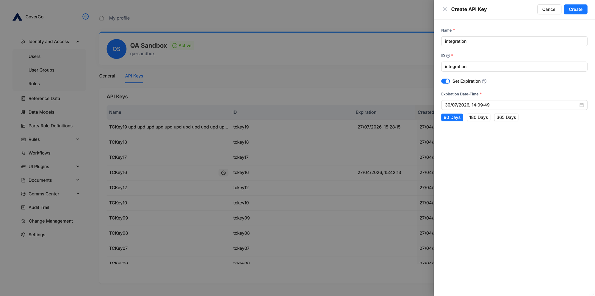
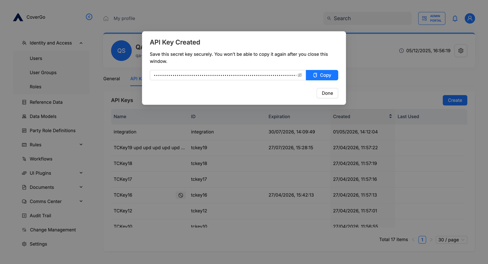
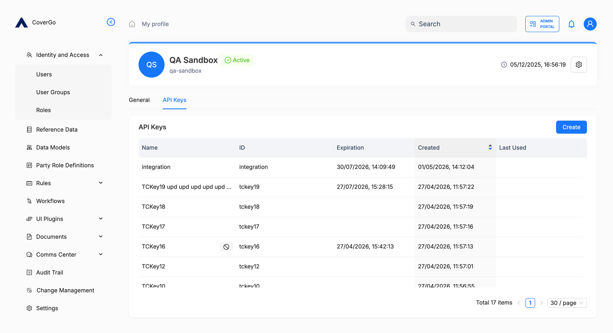
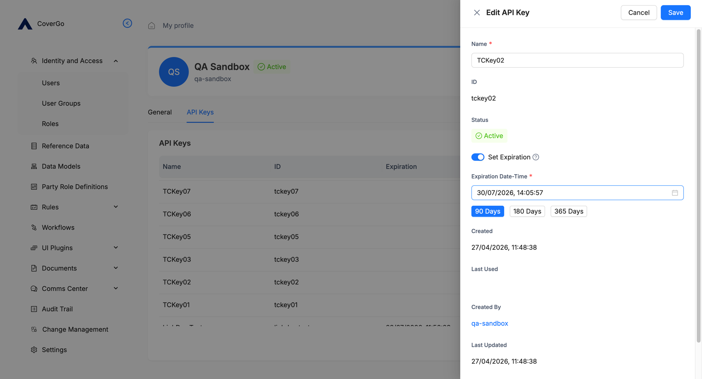
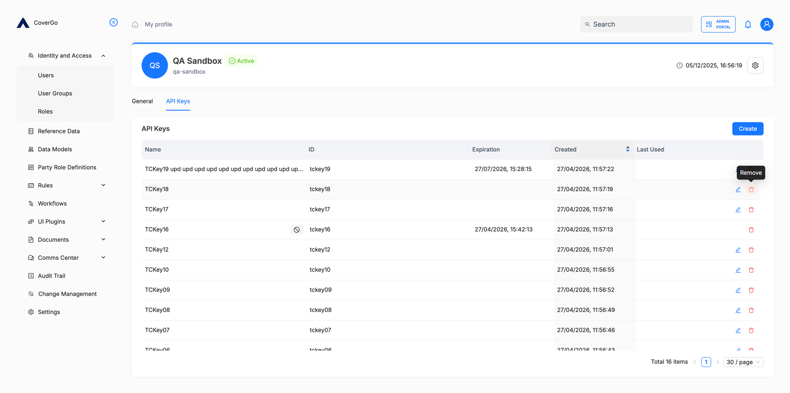

# API keys

An **API key** is a credential issued to a user that lets an external system authenticate to the platform's API as that user. It's the right tool for integrations and automated workflows — a recurring data sync, a webhook receiver, a backend integration in another system — where interactive sign-in isn't an option.

API keys are managed on each user's **API Keys** tab in **Identity and Access → Users**. A user can have up to **20 active keys**. Each key is a long secret string — the platform shows it once, when the key is created, and can never show it again.

## Key concepts

- **Key (secret).** The long random string that authenticates an API request. Shown only at creation; cannot be retrieved afterwards. If lost, remove the key and create a new one.
- **ID.** A short identifier you choose for the key when you create it. Visible in the API keys list and useful for spotting which key is calling — for example, naming the key after the integration that owns it (`billing-sync`, `nightly-export`). It does **not** authenticate requests; only the secret does.
- **Expiration.** An optional date and time after which the key stops working. You can extend it any time before it expires; once expired, a key can only be removed and replaced.
- **Last Used.** The most recent moment the key was accepted on a request. Useful for spotting unused keys and confirming an integration is alive.
- **Permission inheritance.** A key always carries every permission of the user who owns it — there is no per-key scoping. **Choose the owning user carefully**: give an integration its own dedicated user with only the permissions it actually needs (see the [API user pattern](../identity-and-access/users.md#how-to-restrict-how-a-user-signs-in)).

## How to create an API key

1. Open **Identity and Access → Users** and click the user the key will belong to.
2. Click the **API Keys** tab.
3. Click **Create**. The **Create API Key** side panel opens.
4. Fill in:
    - **Name** — a human-friendly name. Shown in the list.
    - **ID** — your unique identifier for the key (e.g. `billing-sync`).
    - **Set Expiration** — toggle on if the key should expire. Pick a preset (**90 Days**, **180 Days**, **365 Days**) or a specific **Expiration Date-Time**. Toggle off for a key that never expires.
5. Click **Create**.



The platform shows the **API Key Created** dialog with the secret. **Copy it now** — once you close the dialog, the secret is gone and cannot be retrieved.


**The secret is shown once and only once.** Copy it from the **API Key Created** dialog before clicking **Done**. Store it somewhere safe — a password manager, a secrets vault, your application's environment configuration. If you lose the secret, the key cannot be recovered; remove it and create a new one.




After **Done**, the key appears in the list with its name, ID, expiration, creation date, and last-used time.



## How to update an API key

You can rename a key or change its expiration any time **before** it expires. After expiry, no edits are possible — the key can only be removed and replaced.

1. On the **API Keys** tab, hover over the key and click the **edit** (pencil) icon.
2. The **Edit API Key** panel opens. Change:
    - **Name** — rename the key.
    - **Set Expiration** and **Expiration Date-Time** — extend the date, change the time, or remove the expiration entirely.
3. Click **Save**.

ID, Status, and the creation metadata (Created, Last Used, Created By, Last Updated) are read-only — they can't be changed from this panel.




**Set a reminder a few days before expiry.** Once a key expires, the integration breaks until you create a new key and roll the integration over to the new secret.


## How to remove an API key

Removing a key invalidates it immediately. Subsequent requests with the key are rejected.

1. On the **API Keys** tab, hover over the key.
2. Click the **remove** (trash) icon at the end of the row and confirm.




**You must remove a user's keys before you can deactivate them.** A user with one or more active API keys cannot be deactivated. Remove the keys first if you need to deactivate the account.


***

## How to use an API key in a request

When calling the API on behalf of the user, send two headers on every request:

- **`Authorization: Bearer <your_api_key>`** — the secret, prefixed with `Bearer`.
- **`X-Tenant: <your_platform_id>`** — the identifier for your platform instance, issued to your organisation when the platform was set up.

A request missing either header is rejected.

```
Authorization: Bearer <your_api_key>
X-Tenant: <your_platform_id>
```

For the full request and response shapes of every operation, see the [User API Key Management API](https://covergo-technologies.stoplight.io/docs/cgp-tenant-admin-service-oas/3ccfb626fa8a6-tenant-user-api-key-management-api) reference. To verify your key works end-to-end, try the [Get user](https://covergo-technologies.stoplight.io/docs/cgp-tenant-admin-service-oas/5573179ad5c8a-returns-a-single-tenant-user-by-field) operation — it returns the user account behind the key, and doesn't require any extra permission when you call it on yourself.

## Reference

### Headers on each request

| Header | Value |
| --- | --- |
| `Authorization` | `Bearer <your_api_key>` |
| `X-Tenant` | Your platform identifier. |

If your client can't set custom headers — for example, on a browser GET to a download URL — pass `X-Tenant` as a **query parameter** instead: `?X-Tenant=<your_platform_id>` on the URL. The header form is preferred for server-to-server calls.

### Permissions

- **Your own API keys.** Every user can create, edit, and remove their own keys without any additional permission.
- **Another user's API keys.** Requires the permissions for managing API keys on the `User` resource (granted through a role). See [Users › Permissions](../identity-and-access/users.md#permissions) for which permissions cover which actions.

### Limits

- **Up to 20 active keys per user.** Remove an unused or unwanted key before creating a 21st.

### API reference

- [User API Key Management API](https://covergo-technologies.stoplight.io/docs/cgp-tenant-admin-service-oas/3ccfb626fa8a6-tenant-user-api-key-management-api) — operations for creating, listing, editing, and removing keys.
- [Get user](https://covergo-technologies.stoplight.io/docs/cgp-tenant-admin-service-oas/5573179ad5c8a-returns-a-single-tenant-user-by-field) — example operation that uses Bearer authentication; useful for verifying that your key works.

## Troubleshooting

<details>

<summary><strong>I lost the secret immediately after creating the key.</strong></summary>

The secret is shown only once and can't be recovered. Remove the key and create a new one. Next time, copy the secret from the **API Key Created** dialog and store it somewhere safe before clicking **Done**.

</details>

<details>

<summary><strong>My request is rejected with 401 / Unauthorized.</strong></summary>

Check, in order:

1. The `Authorization` header is exactly `Bearer <key>` — the word `Bearer`, one space, then the secret.
2. The `X-Tenant` header is set to your platform identifier.
3. The key hasn't expired — open the user's **API Keys** tab and check the **Expiration** column.
4. The key hasn't been removed.
5. The owning user is **Active** and not currently suspended. Keys stop working when the user can't sign in. See [Users](../identity-and-access/users.md).
6. The owning user has the permissions for the operation you're calling — keys inherit the user's permissions exactly.

</details>

<details>

<summary><strong>My key just expired and the integration is broken.</strong></summary>

An expired key can't be extended. Create a new key on the same user, copy the new secret, and update the integration to use it. The old, expired key can stay in the list until you remove it.

To avoid this next time, set a reminder a few days before the expiration date and extend the key while it's still valid.

</details>
