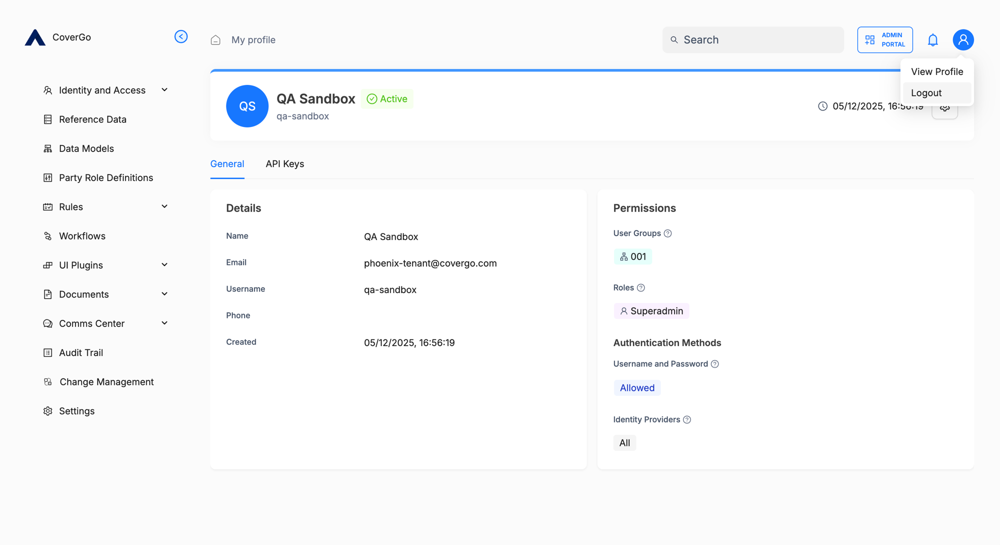

# Sessions

After you sign in to a portal, the platform remembers you so you don't have to sign in again on every page. That memory is your **session**. It lasts as long as you're using the platform — within fixed limits — and ends either when you sign out, when those limits are reached, or when an administrator intervenes.

Sessions cover **portal sign-in only**. API requests don't use sessions — every request carries its own credentials. See [API keys](api-keys.md).

## How long your session lasts

Two fixed limits apply to every session:

- **Idle timeout — 30 minutes.** If you don't do anything in the platform for 30 minutes, your session ends. The next time you try to do something you'll be sent back to the sign-in screen.
- **Maximum lifetime — 30 days.** Even with continued use, your session expires 30 days after you signed in, and you'll need to sign in again.

Both limits are fixed at the platform level — they're the same for every user.

There's no limit on the number of active sessions you can have. You can be signed in from multiple browsers or devices at the same time.

## Sessions cover all portals and tabs

Once you sign in, you're signed in to every portal you have access to — in any tab or window of the same browser. Open another portal in a new tab and you'll already be signed in. The same goes for sign-out: signing out from one portal or one tab signs you out of every portal and every tab in that browser.

Incognito and private windows are an exception. Each one is treated as a separate browser, needs its own sign-in, and is discarded when you close the window.

## How to sign out

1. Click the user icon in the top right of any portal screen.
2. Choose **Logout**.

You're signed out of every portal and tab in this browser, and sent to the sign-in screen.

## Other ways your session ends

Apart from idle timeout, maximum lifetime, and signing out manually, your session can also end when:

- **An administrator clicks End sessions** on your user record. See [Users › Admin actions](../identity-and-access/users.md#admin-actions). Actions you have in flight may complete for a short time afterwards; the next time you navigate, you'll be sent to the sign-in screen.
- **An administrator deactivates your account.** Your session ends immediately and you won't be able to sign in again until the account is reactivated.

## Troubleshooting

<strong>I was just signed in — why am I being asked to sign in again?</strong>

Your session probably ended for one of these reasons:

- **30 minutes of inactivity** (idle timeout) — you stepped away from the screen or left the tab open without using it.
- **30 days have passed** since you signed in (maximum lifetime).
- **An administrator ended your sessions** from the gear menu on your user record.
- **An administrator deactivated your account.** Sign-in will fail entirely until the account is reactivated.

<strong>I signed out in one tab. Why am I signed out in the others too?</strong>

That's by design. A single session covers every portal and every tab in the same browser, so signing out anywhere ends it everywhere. To stay signed in to multiple portals, just leave the tabs open — you don't need separate sessions.

<strong>I'm using an incognito window and have to sign in even though I'm signed in elsewhere.</strong>

Incognito and private windows are treated as separate browsers. Sessions don't carry over from your normal browsing, and they're discarded when you close the incognito window.

