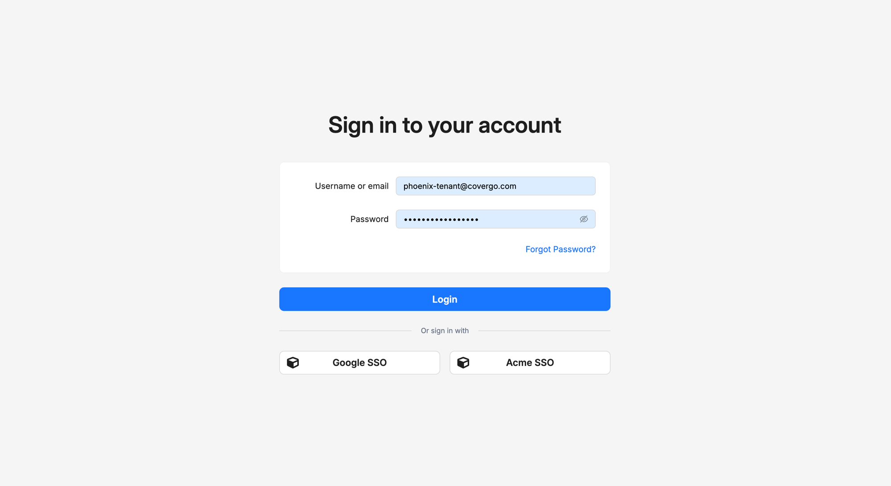

# Sign in

Each portal has its own URL. When you open it, the platform sends you to the sign-in screen if you aren't already signed in. Once you sign in, you go straight to the page you originally wanted, and you can use any other portal you have access to in the same browser without signing in again.

You can sign in two ways:

- with your **username (or email) and password**, or
- via an **identity provider** your administrator has configured (for example, your organisation's corporate sign-in).

## How to sign in with your password

1. Open the URL of the portal you want to use.
2. On the **Sign in to your account** screen, enter your **username or email**.
3. Enter your **password**.
4. Click **Login**.

You're sent to the page you originally requested.

If you've forgotten your password, click **Forgot Password?** below the password field and follow the email link the platform sends — see [Reset your password](reset-password.md).

## How to sign in with an identity provider

If your administrator has configured one or more identity providers, you'll see them as buttons below the **Or sign in with** divider on the sign-in screen — for example, **Google SSO** or your organisation's corporate sign-in.

1. On the **Sign in to your account** screen, click the button for the provider you use.
2. You're sent directly to that provider's sign-in page. Sign in there with your existing credentials.
3. The provider sends you back to the platform, and you go straight to the page you originally wanted — there's no separate sign-in step on the platform side.

If your account doesn't yet exist on the platform but the identity provider allows sign-up, the platform creates it on the fly the first time you sign in this way. See [Identity Providers](identity-providers.md).

## Signing out

Click the user icon in the top right of any portal screen and choose **Logout**. See [Sessions](sessions.md) for how long sessions last and what else can end them.

## Troubleshooting

<strong>I see "Error validating user and/or password".</strong>

This message is deliberately vague — for security, the platform doesn't reveal whether the username or the password was wrong. Check both, then try again.

If you enter the wrong password **five times in a row**, your account is automatically suspended for 30 minutes. You'll keep seeing the same generic error during that window. You can wait it out, or click **Forgot Password?** to issue a reset email — a successful password reset clears the suspension. See [Reset your password](reset-password.md).

If you're sure the username and password are correct and you still can't sign in, ask your administrator to check the status of your account and your authentication methods. See [Users](../identity-and-access/users.md).

<strong>I just got my account, but I don't have a password yet.</strong>

If an administrator created your account, the platform sent you a verification email — click the link in that email to set your initial password. See [Activate your account](activate-account.md). If you didn't receive the email or the link expired, ask your administrator to resend it.

<strong>The identity-provider button I expect isn't on the screen.</strong>

The buttons under **Or sign in with** appear only when an administrator has configured the provider. If you expect to sign in with a specific provider and don't see it, ask your administrator whether it's configured. See [Identity Providers](identity-providers.md).

<strong>I'm sure my password is right, but sign-in still fails.</strong>

Several things can block a correct password from working:

- **Your account is suspended** — five wrong passwords in a row temporarily lock the account for 30 minutes. Either wait the 30 minutes or click **Forgot Password?** (a successful reset clears the lock).
- **Your account is deactivated** — an administrator has revoked your access. Ask them to reactivate it.
- **Your account is in Pending status** — you haven't activated it yet. See [Activate your account](activate-account.md).
- **Your account is restricted to certain authentication methods** — for example, restricted to identity providers only, in which case password sign-in won't work. Ask your administrator to review your authentication methods.

