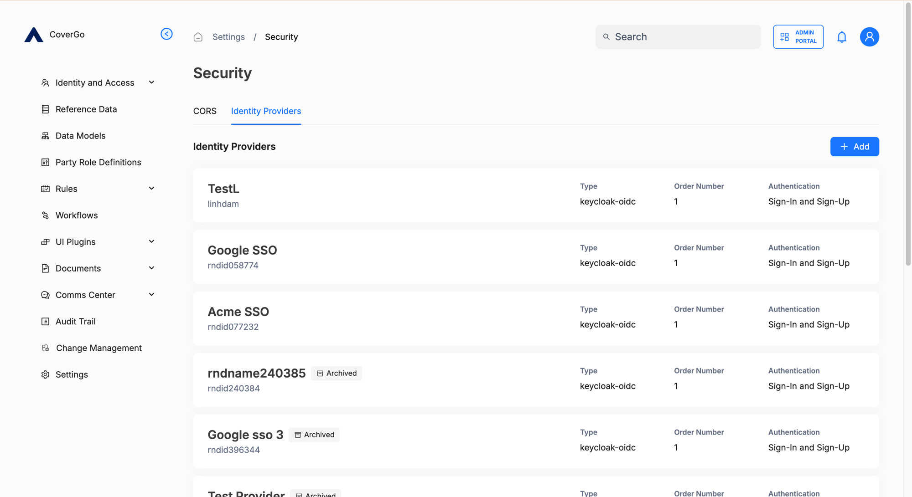
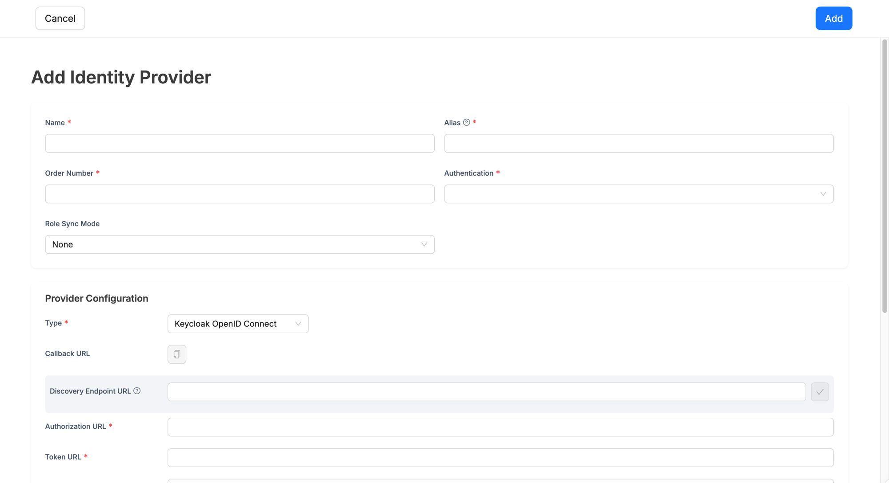
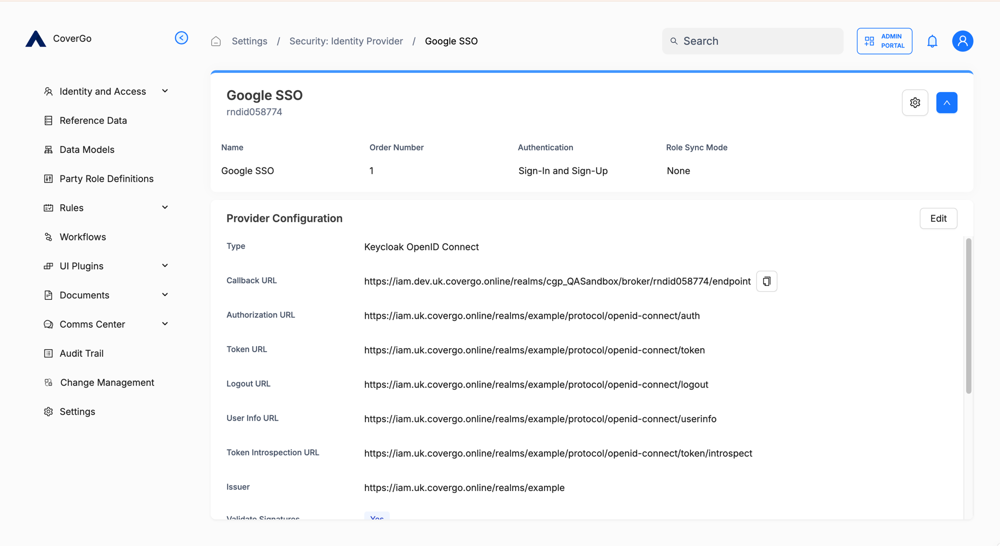
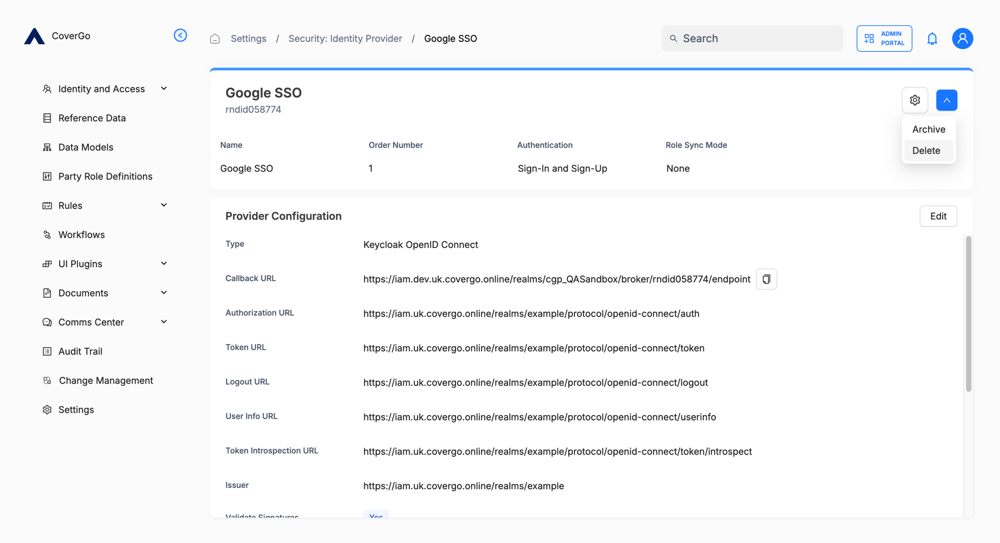

# Identity Providers

An **identity provider** (IdP) is a service that verifies a user's credentials and tells the platform who the verified user is. The platform comes with a built-in identity provider — username and password — and you can add others so users can sign in with credentials they already use elsewhere.

Common reasons to add an external identity provider:

- Letting employees sign in with their **existing corporate sign-in**.
- Letting partners sign in with **Google**, **Microsoft**, or any OpenID Connect provider.
- Reducing the number of passwords your users have to remember.

When an external provider is configured, it appears as a button on the sign-in screen alongside the username and password form. See [Sign in](sign-in.md).

## Key concepts

- **Default identity provider.** Username and password, verified by the platform itself. Always available; nothing to configure. Every user gets it by default unless an administrator restricts their authentication methods.
- **External identity provider.** Any provider you add. Each has its own configuration and its own button on the sign-in screen.
- **Alias.** A stable identifier you choose for the provider — for example, `corporate-sso` or `google`. Used in the platform's callback URL and as the value of `kc_idp_hint` when an [external application](sso-for-external-applications.md#skipping-the-sign-in-screen-with-kc_idp_hint) wants to skip the sign-in screen and route users straight to a specific provider.
- **Order Number.** Controls the order of buttons on the sign-in screen. Lower numbers appear first.
- **Authentication mode.** What the provider can be used for — **Sign-In Only** (existing users only) or **Sign-In and Sign-Up** (also allows new accounts to be created on first sign-in).
- **Role Sync Mode.** Controls how roles from the upstream provider apply to platform users. Three options: **None** (no sync), **Sign-Up** (sync once, on the user's first sign-in), or **Sign-In** (re-sync on every sign-in). See [How role sync works](#how-role-sync-works) for the details.

## How to add an identity provider

Identity providers live under **Settings → Security → Identity Providers**.

1. Click **+ Add**. The **Add Identity Provider** page opens.
2. Fill in the basics:
    - **Name** — the human-readable name. Shown as the button label on the sign-in screen.
    - **Alias** — a stable identifier (lowercase, no spaces). Used in the callback URL and as the `kc_idp_hint` value.
    - **Order Number** — where the button appears on the sign-in screen relative to other providers.
    - **Authentication** — pick **Sign-In Only** for existing users only, or **Sign-In and Sign-Up** to also allow new accounts to be created on first sign-in through this provider.
    - **Role Sync Mode** — leave at **None** unless you want roles to sync from the upstream provider.

    

3. In **Provider Configuration**, choose a **Type** from the dropdown and fill in the fields that appear for that type. See [Supported provider types](#supported-provider-types) below for the fields each type expects.
4. Click **Add** in the top right.

The new provider appears in the list and as a button on the sign-in screen — users can sign in with it immediately.


**New users created through this provider start with sign-in restrictions.** When someone signs up via this identity provider for the first time, the platform automatically configures their new account to:

- block username and password sign-in, and
- only allow sign-in via the identity provider that created the account.

This keeps each account tied to the way it was originally created. An administrator can lift either restriction later on the user's detail page — see [Users › How to restrict how a user signs in](../users.md#how-to-restrict-how-a-user-signs-in).


## How to view or edit an identity provider

1. Open **Settings → Security → Identity Providers**.
2. Click the provider in the list. The view page opens.
3. Click **Edit** in the **Provider Configuration** card. Both the top-of-page details (Name, Order Number, Authentication, Role Sync Mode) and the Provider Configuration fields become editable.
4. Click **Save** to apply your changes, or **Cancel** to discard.

## How to archive or delete an identity provider

Click the gear icon at the top right of a provider's view page to **Archive** or **Delete** it.

- **Archive** keeps the provider in the list with an **Archived** badge, but it no longer appears as a button on the sign-in screen and can't be used for new sign-ins. Existing users who signed in via the provider keep their accounts. An archived provider can be unarchived later.
- **Delete** removes the provider entirely. Users who were created via this provider keep their accounts but lose this sign-in option. Use this when a provider was created by mistake; prefer **Archive** when there's any history to preserve.

## How role sync works

When **Role Sync Mode** is set to **Sign-Up** or **Sign-In**, the platform syncs roles from the upstream provider into the user's role assignments on the platform.

For sync to work:

- Your upstream provider must include a `roles` claim in the token issued to the platform — typically a list of role identifiers.
- The IDs in the claim must match the IDs of [Roles](../roles.md) defined on the platform.

When the platform receives the token, it **replaces** the user's direct role assignments with the matched set — every existing assignment is removed, and only roles whose IDs match the claim apply going forward. IDs in the claim that don't match a platform role are ignored.

The two sync modes differ in when this happens:

- **Sign-Up.** Roles are synced once, on the user's very first sign-in through this provider (when the platform account is created). Subsequent sign-ins don't touch role assignments, so an administrator can adjust them on the platform without losing those changes.
- **Sign-In.** Roles re-sync on every sign-in. Any role changes an administrator makes on the platform are overwritten the next time the user signs in through this provider — keep role management on the upstream provider in this mode.

## Reference

### Top-level fields

| Field | What it is | Required |
| --- | --- | --- |
| **Name** | Human-readable name. Shown as the button label on the sign-in screen. | Yes |
| **Alias** | Stable identifier. Used in the callback URL and as the `kc_idp_hint` value. | Yes |
| **Order Number** | Order on the sign-in screen. Lower numbers appear first. | Yes |
| **Authentication** | What the provider can be used for: **Sign-In Only** or **Sign-In and Sign-Up**. | Yes |
| **Role Sync Mode** | How roles from the upstream provider apply to platform users. **None** (no sync), **Sign-Up** (sync once on first sign-in), or **Sign-In** (re-sync on every sign-in). Defaults to **None**. See [How role sync works](#how-role-sync-works). | No |

### Supported provider types

Today the platform supports one identity provider type. The list will grow over time.

#### Keycloak OpenID Connect

For connecting to any OpenID Connect provider, including upstream Keycloak realms.

| Field | What it is | Required |
| --- | --- | --- |
| **Callback URL** | Auto-generated by the platform. Register this URL as the redirect URI on your upstream provider. | — |
| **Discovery Endpoint URL** | Your provider's `.well-known/openid-configuration` URL. Click the validate button next to the field to auto-fill the URLs below. If your provider doesn't expose discovery, fill the URLs in manually. | No, but recommended |
| **Authorization URL** | Where the platform sends users to sign in. | Yes |
| **Token URL** | Where the platform exchanges authorisation codes for tokens. | Yes |
| **Logout URL** | Where the platform sends users on sign-out so they can sign out of the upstream provider too. | No |
| **User Info URL** | Where the platform retrieves the user's profile information. | No |
| **Token Introspection URL** | Where the platform verifies token validity. | No |
| **Issuer** | The expected `iss` claim value on tokens issued by the upstream provider. | No |
| **Validate Signatures** | Whether to verify token signatures using the provider's JWKS. Recommended. | No (toggle) |
| **Use PKCE** | Whether to use PKCE on the authorisation request. | No (toggle) |
| **Client ID** | Issued to you when you registered the platform with your upstream provider. | Yes |
| **Client Secret** | The corresponding secret. Confidential — treat it like a password. | Yes |

### Permissions

What an administrator can do with identity providers depends on which permission group they hold on the `Identity Provider` authorisation resource:

| Action | `readonly` | `manage` | `admin` |
| --- | --- | --- | --- |
| List identity providers | ✓ | ✓ | ✓ |
| View an identity provider | ✓ | ✓ | ✓ |
| Create an identity provider | | ✓ | ✓ |
| Update an identity provider | | ✓ | ✓ |
| Archive or unarchive | | | ✓ |
| Delete | | | ✓ |

See [Roles](../roles.md) for how to grant an administrator one of these permission groups.

## Troubleshooting

<strong>The Discovery Endpoint URL didn't auto-fill the other URL fields.</strong>

Click the validate button (the checkmark) next to the field after pasting the URL. The platform fetches the discovery document and populates the URLs. If validation fails, the URL might be wrong, the discovery document might not be public, or the platform can't reach the provider — fill in the URLs manually in that case.

<strong>The provider's button appears on the sign-in screen, but signing in with it fails.</strong>

Most often this is a redirect-URI mismatch. Open the identity provider's view page on the platform, copy the **Callback URL**, and confirm it's registered exactly that way as a redirect URI on your upstream provider — including scheme, host, port, and path.

Other things to check:

- The **Client ID** and **Client Secret** match what your upstream provider issued.
- The Discovery Endpoint URL (or the manual URLs) match your provider's actual endpoints.
- **Validate Signatures** is on, and the upstream provider is publishing JWKS at the URL the platform discovered.

<strong>The provider doesn't appear as a button on the sign-in screen.</strong>

Check that:

- The provider isn't archived. Archived providers stay in the list (with an **Archived** badge) but no longer appear on sign-in.
- Your user account isn't restricted to a specific subset of identity providers — see [Users](../users.md#how-to-restrict-how-a-user-signs-in).

<strong>How do I remove an identity provider?</strong>

Click the gear icon at the top right of the provider's view page. You have two options:

- **Archive** keeps the provider in the list with an **Archived** badge but stops it from appearing on the sign-in screen.
- **Delete** removes the provider entirely.

See [How to archive or delete an identity provider](#how-to-archive-or-delete-an-identity-provider).

