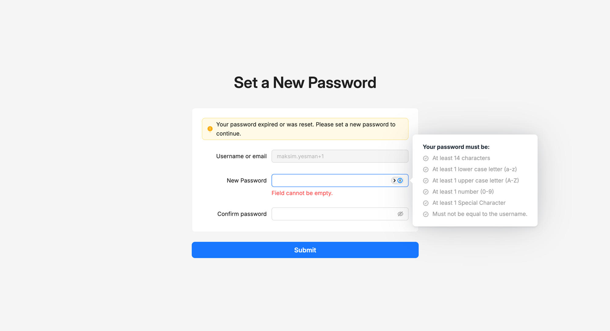

# Password policy

Every password set on the platform — whether you're activating a brand-new account, resetting a forgotten one, or replacing a password that expired — must meet the same set of rules. The platform enforces the policy as you type, and won't accept a password that doesn't meet it.

The policy is fixed at the platform level — there's no admin screen for changing the rules, and they are the same for every user.

## The rules

Your password must:

- Be at least **14 characters** long.
- Contain at least **one lowercase letter** (`a`–`z`).
- Contain at least **one uppercase letter** (`A`–`Z`).
- Contain at least **one number** (`0`–`9`).
- Contain at least **one special character**.
- Not be equal to your username.

## Where you'll see the policy

The rules show up on every screen where you set or change a password. They appear as a checklist next to the **New Password** field, and items become checked off as you meet them.

Three screens enforce the policy:

- **Complete Verification** — when you activate a new account. See [Activate your account](activate-account.md).
- **Set a New Password** — when your password expired or an administrator reset it.
- **Reset password** — when you forgot your password and asked for a reset. See [Reset your password](reset-password.md).

The platform also expires passwords periodically. When yours expires, the next time you sign in you'll be sent to the **Set a New Password** page to choose a new one before you can continue.

## Troubleshooting

<strong>My password is being rejected.</strong>

Look at the password requirements panel next to the field — items shown unchecked are the rules you haven't met yet. Adjust your password to satisfy each rule.

<strong>I just signed in with my current password and now I'm being asked to set a new one.</strong>

Your password expired, or an administrator reset it. The **Set a New Password** page handles this — set a new password that meets the rules above and you'll be back to where you were.

