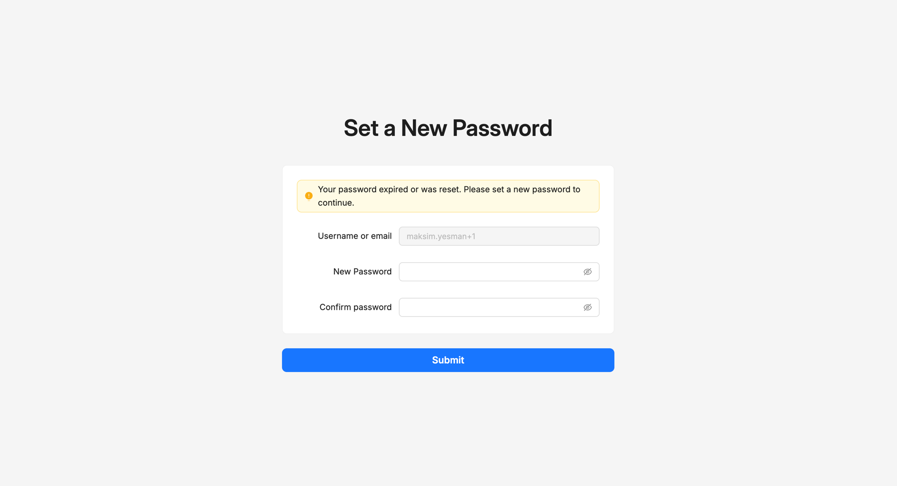

# Reset your password

If you've forgotten your password, you can reset it from the sign-in screen. The platform sends you an email with a one-time link that takes you to a page where you set a new one. The same flow is what an administrator triggers when they reset a password on your behalf.

This is the **only** way to change a password — there's no in-portal change-password screen. If you're signed in and want a new password, go through the reset flow.

## How to reset your own password

1. Open the [Sign in](sign-in.md) screen and click **Forgot Password?**
2. Enter your username or email and submit.
3. Open the reset email the platform sent to your address. The link is valid for **12 hours**.
4. Click the link. You'll land on the **Set a New Password** page.
5. Enter and confirm a new password that meets the [Password policy](password-policy.md).
6. Click **Submit**.

You can now sign in with the new password.


**The reset link expires after 12 hours.** If your link no longer works, repeat the **Forgot Password?** flow from the sign-in screen to issue a fresh email.


## How to reset another user's password (administrators)

When a user has lost access and needs help, you can trigger the same reset flow from their detail page. They receive the email; they set the new password themselves. The platform never gives the new password to anyone — including the administrator who triggered the reset.

1. Open **Identity and Access → Users** and click the user.
2. Click the gear icon at the top right of the detail page and choose **Reset password**.
3. Confirm the action.
4. The user receives an email with a reset link valid for **12 hours**. They follow the user-side steps above.

See [Users](../users.md#admin-actions) for the gear-menu screenshot.

## If you sign in via an identity provider

If your account uses an external [identity provider](identity-providers.md), the platform doesn't store your password and can't reset it. Reset your password in the system you normally sign in with — your corporate sign-in, for example — and the platform automatically picks up the new credentials the next time you sign in.

## Reference

### Validity

The reset email's link is valid for **12 hours** from the time the email was sent. After that, the link no longer works and you'll need to issue a new one.

### Permissions

To reset another user's password, you need the **Reset Password** permission on the `User` resource. See [Users › Permissions](../users.md#permissions).

### Password requirements

The new password must meet your organisation's [Password policy](password-policy.md). The Set a New Password page enforces the policy as you type.

### Effect on suspension

A successful password reset clears any active suspension on the user (the temporary lock after five failed sign-in attempts). See [Users › Suspension](../users.md#suspension).

## Troubleshooting

<strong>I didn't get the reset email.</strong>

Check your spam folder first. If it's not there:

- The address might be wrong on your account — ask your administrator to confirm and correct it.
- Some email systems delay or quarantine messages from unfamiliar senders; if you're not seeing it after a few minutes, check with your IT team.
- Try the **Forgot Password?** flow again to issue a new email.

<strong>The reset link doesn't work.</strong>

Most likely the link expired (it's valid for 12 hours), or the link has already been used. Open the [Sign in](sign-in.md) screen and use **Forgot Password?** again to issue a fresh email.

<strong>I'm signed in and just want to change my password.</strong>

There's no in-portal change-password screen. Use the reset flow:

1. Sign out, or open the sign-in screen in another tab.
2. Click **Forgot Password?** and enter your username or email.
3. Follow the link in the email and set the new password.

You can also ask your administrator to reset your password for you, which produces the same email.

<strong>I clicked Forgot Password twice and got two emails. Which one should I use?</strong>

Use the most recent email. Issuing a new reset invalidates any earlier links you've received.

