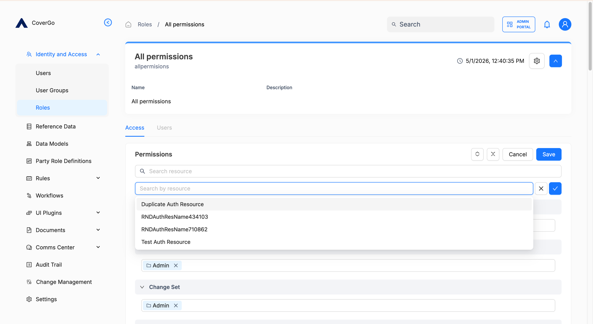

# Authorisation Resources

An **authorisation resource** is one entry in the platform's catalogue of "things you can grant access to." Each resource defines:

- The **permissions** that exist on it (`read`, `update`, `delete`, …).
- The **permission groups** that bundle those permissions into common combinations (`readonly`, `manage`, `admin`).

When you assign permissions to a [role](roles.md) or a [user group](user-groups.md), you're picking from these resources and their groups. So everything the access-control system can grant is, ultimately, defined by some authorisation resource.

The platform ships with **system-defined** authorisation resources for every built-in capability — User, Role, Document, Workflow, and so on. You can also define **custom** authorisation resources for resource types your organisation extends the platform with. Custom definitions are managed via the public API.

## Key concepts

- **Authorisation resource.** A definition that names a resource type and the permissions that exist on it.
- **Permission.** A single, atomic action verb on the resource — `read`, `create`, `update`, `delete`, `list`. The verb is scoped to the resource it's defined on.
- **Permission group.** A named bundle of permissions on the same resource — for example, `readonly` = `read` + `list`, `manage` = `read` + `list` + `create` + `update`. Groups are the ergonomic way to grant access; you almost always pick a group instead of individual permissions.
- **System-defined resource.** Shipped with the platform. Covers every built-in capability. Can't be removed.
- **Custom resource.** Defined by your organisation via the API. Used when you extend the platform with a new resource type that needs its own access controls.

## How to view system resources

System-defined resources don't have their own list page — you discover them through the resource picker when you edit a [role](roles.md#how-to-assign-permissions-to-a-role) or a [user group's permissions](user-groups.md#how-to-assign-permissions-to-a-user-group-directly). The picker shows every authorisation resource (system and custom alike) with its permission groups and individual permissions.



## How to define a custom authorisation resource

Custom resources are managed via the public API — there's no UI for creating them today.

1. Open the [Authorisation Resource API](https://covergo-technologies.stoplight.io/docs/cgp-tenant-admin-service-oas/d5f07fc226461-authorisation-resource-api) reference.
2. Call `POST /authorisation-resources` (the **Create Authorisation Resource** operation) with a body that names the resource and lists its permissions and permission groups.
3. Once created, the resource appears in the picker on roles and user groups, and you can assign its permissions like any system resource.

### Example body

```json
{
  "lifetimeId": "USER",
  "name": "User",
  "permissions": [
    "create",
    "read",
    "update",
    "delete",
    "list"
  ],
  "permissionGroups": [
    {
      "name": "readonly",
      "permissions": ["read", "list"]
    },
    {
      "name": "manage",
      "permissions": ["create", "read", "update", "list"]
    }
  ]
}
```

This defines a `User` resource with five permissions and two groups. Groups list the permissions they bundle by name — every name in a group must also appear in the resource's `permissions` list.

## How to update or delete a custom authorisation resource

- **Update** — call `PUT /authorisation-resources/{lifetimeId}` (the **Update Authorisation Resource** operation) with the new definition. You can add permissions and groups; **be cautious about removing them** — any role or user group that had been granting a removed permission silently loses that access.
- **Delete** — call `DELETE /authorisation-resources/{lifetimeId}` (the **Delete Authorisation Resource** operation). Removes the resource entirely. Every role and user group that had any permissions on it loses those permissions.

System-defined resources can't be updated or deleted via the API.


**Removing or deleting permissions cascades silently.** When you remove a permission or group from a resource, or delete the resource itself, every role and user group that referenced what you removed loses that piece of access immediately. There's no warning and no auto-archiving — make changes deliberately, and audit roles and user groups before you commit a destructive update.


## Reference

### API reference

See the [Authorisation Resource API](https://covergo-technologies.stoplight.io/docs/cgp-tenant-admin-service-oas/d5f07fc226461-authorisation-resource-api) for the full operation reference, request and response shapes, and try-it-out console.

Authorisation resources are not versioned, can't be archived, and don't require a [publish](../../todo-publish.md) step — changes go live immediately.

### Definition fields

| Field | What it is | Required |
| --- | --- | --- |
| `lifetimeId` | A stable identifier for the resource. Used in URLs and references. | Yes |
| `name` | Human-readable display name shown in pickers. | Yes |
| `permissions` | The list of action verbs available on the resource. Each is a short lowercase string (e.g. `read`, `create`). | Yes |
| `permissionGroups` | The named bundles of permissions. Each group has a `name` and a `permissions` array referencing names from the resource's `permissions` list. | No |

### Permissions

| Action | `admin` |
| --- | --- |
| Create, list, update, or delete a custom authorisation resource | ✓ |

Authorisation Resource access is gated by a single permission group — `admin` on the `Authorisation Resource` authorisation resource. There's no read-only or manage-only tier.

## Troubleshooting

<details>

<summary><strong>I added a permission to a custom resource but it's not showing up on existing roles.</strong></summary>

Adding a permission to a resource definition doesn't change any role or user group automatically — they still grant the same permissions they did before. If the existing roles should now include the new permission, edit each role and add it explicitly.

</details>

<details>

<summary><strong>I deleted a custom resource and a bunch of roles look broken.</strong></summary>

Expected. Deleting a resource removes every permission it defined; any role or user group that was granting those permissions silently loses them. If the deletion was a mistake, recreate the resource (with the same `lifetimeId`, `permissions`, and `permissionGroups`) and re-edit each role and user group to grant access through it again.

</details>

<details>

<summary><strong>Can I add a custom permission to a system-defined resource?</strong></summary>

No. System-defined resources are immutable — you can't change their permissions or permission groups. If you need extra access controls on top of a built-in capability, define a custom resource alongside it instead.

</details>
