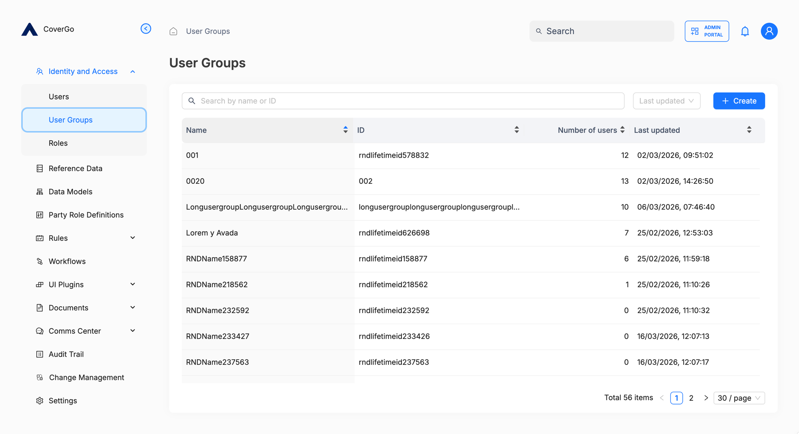
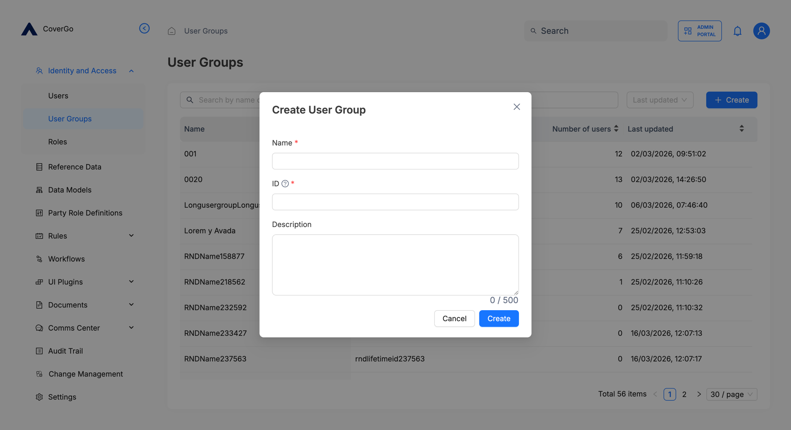
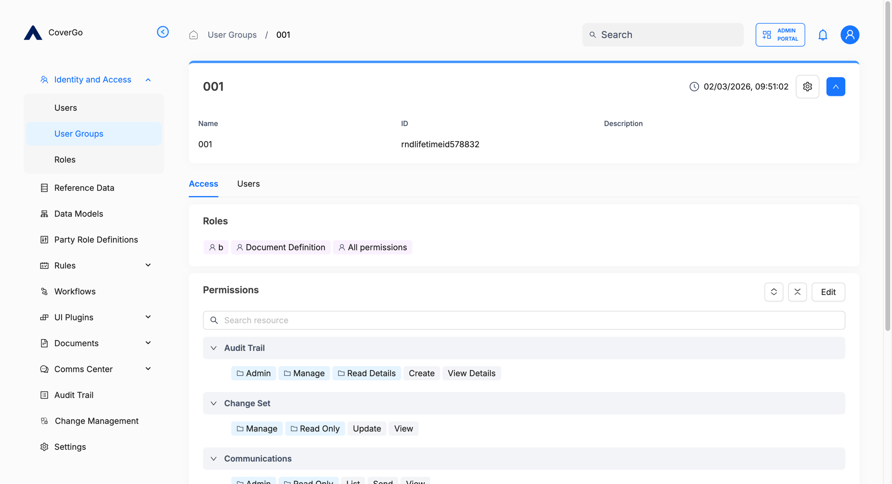
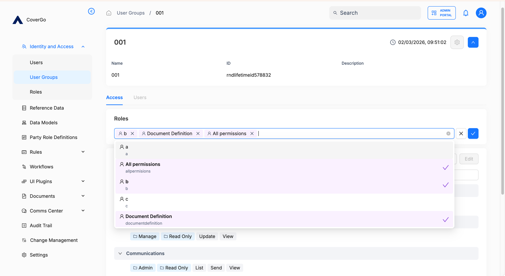
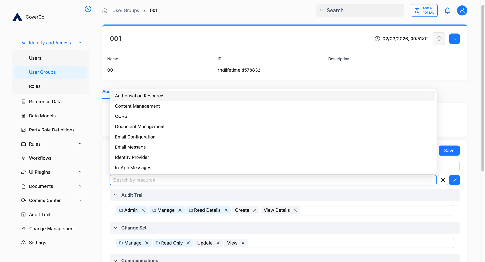
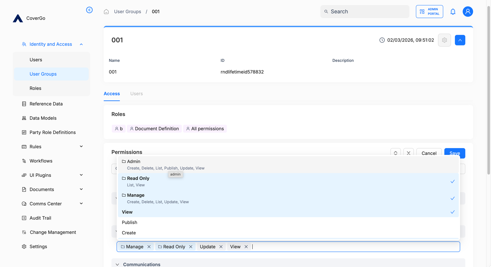

# User Groups

A **user group** is a named collection of users — typically aligned with how your organisation actually works ("Operations Team", "Claims Handlers", "Auditors"). Roles and permissions assigned to the group apply to every user in it, so when team membership changes you adjust the group instead of editing each user.

User groups are managed in **Identity and Access → User Groups**. A user can belong to **any number of user groups** — their effective access is the union of every role and every permission that flows through their memberships, plus any roles assigned directly to them.

## Key concepts

- **User group.** A named collection of users. Has its own roles and permissions, both of which apply to every member.
- **ID.** A short, stable identifier you choose when creating the group (e.g. `operations-team`, `auditors`). Used in audit logs and integrations.
- **Membership.** A user can be in zero, one, or many user groups. Groups are flat — a group can't contain other groups.
- **Roles on a group.** [Roles](roles.md) assigned to the group. Every member effectively holds those roles.
- **Permissions on a group.** Permissions that don't fit a role and need to apply to the group's members directly. Same building blocks as roles, drawn from [authorisation resources](authorisation-resources.md).

## How to find a user group

1. Open **Identity and Access → User Groups**.
2. Type a name or ID into the search box. The list filters as you type.
3. Sort by **Last updated** to find recently changed groups, or by **Number of users** for the busy ones.
4. Click any row to open that group's detail page.

## How to create a user group

1. On the User Groups list, click **+ Create**. The **Create User Group** dialog opens.
2. Fill in:
    - **Name** — a human-readable name. Shown wherever the group is referenced.
    - **ID** — the stable identifier. Lowercase, no spaces (e.g. `operations-team`).
    - **Description** — optional; up to 500 characters.
3. Click **Create**.

The new group opens with no users, roles, or permissions assigned yet.

## How to view a user group

1. Open **Identity and Access → User Groups** and click the group.
2. The detail page has two tabs:
    - **Access** — the roles and permissions assigned to the group.
    - **Users** — the users in the group.

## How to add or remove users in a group

1. Open the group's detail page → **Users** tab.
2. Click **Add**. A search field opens.
3. Type the user's name, email, or username and pick from the dropdown.
4. Click the confirmation checkmark.

To remove a user, click the **×** (trash icon) at the end of their row.

You can also manage membership from the user's own detail page — see [Users › How to assign roles and user groups](../users.md#how-to-assign-roles-and-user-groups). Both routes produce the same result.

## How to assign roles to a user group

Use roles when you have a coherent bundle of permissions that the whole group should hold — that's the ergonomic path.

1. Open the group's detail page → **Access** tab.
2. In the **Roles** card, click into the input. The roles dropdown opens.
3. Pick the roles to assign. Click an existing pill to remove a role.
4. Click the confirmation checkmark to save.

See [Roles](roles.md) for how to create new roles.

## How to assign permissions to a user group directly

You can also assign permissions to a group directly, bypassing roles. Use this for one-off bundles where creating a role doesn't pay off.

1. Open the group's detail page → **Access** tab.
2. In the **Permissions** card, click **Edit**. The card becomes editable.
3. Click **Show resource** to add a resource. The resource picker opens.
4. Pick the resource the group should have access to.

    

5. Click into the dropdown next to the resource and pick a permission group or individual permissions.

    

6. Repeat for every resource. Click **Save** when done.


**Prefer roles when several groups will need the same access.** Roles are reusable; group-level permissions are not. If two groups should have the same set of permissions, define a role once and assign it to both groups.


## How to update a user group

- **Name and description** — open the group and use the gear icon at the top right.
- **ID** — not editable after creation.
- **Membership** — see [How to add or remove users in a group](#how-to-add-or-remove-users-in-a-group).
- **Roles and permissions** — see the corresponding sections above.

## How to delete a user group

1. Open the group's detail page.
2. Click the gear icon at the top right.
3. Choose **Delete** and confirm.

Deleting a group immediately removes its roles and direct permissions from every member. Members keep their accounts and any roles or permissions they hold by other means (other groups, direct role assignments). The audit trail of past membership stays intact.

<!-- TODO: add screenshot of the gear-icon menu on a user group's detail page showing the Delete action. -->

## Reference

### Fields

| Field | What it is | Required | Editable later |
| --- | --- | --- | --- |
| **Name** | Human-readable name. | Yes | Yes |
| **ID** | Stable identifier (lowercase, no spaces). | Yes | No |
| **Description** | Free-form description, up to 500 characters. | No | Yes |

### Permissions

What an administrator can do with user groups depends on which permission group they hold on the `User Group` authorisation resource:

| Action | `readonly` | `manage` | `admin` |
| --- | --- | --- | --- |
| List user groups | ✓ | ✓ | ✓ |
| View a user group | ✓ | ✓ | ✓ |
| Create a user group | | ✓ | ✓ |
| Update a user group's name and description | | ✓ | ✓ |
| Update a user group's permissions | | | ✓ |
| Add or remove users in a group | | | ✓ |
| Assign or unassign roles on a group | | | ✓ |
| Delete a user group | | | ✓ |

## Troubleshooting

<strong>I removed a user from a group, but they still seem to have access from it.</strong>

If the user is signed in, their existing session may still be using the access they had. Use **End sessions** on their user record to force a re-evaluation — see [Users › Admin actions](../users.md#admin-actions). They'll pick up the updated access on their next sign-in.

The user might also be getting the same access through another group or directly. Open their detail page to see all assigned roles and groups.

<strong>I deleted a user group and several users lost access.</strong>

Expected. Deleting a group removes its roles and direct permissions from every member. If the deletion was a mistake, recreate the group, reassign its roles and permissions, and re-add the members.

<strong>Why can't a group contain other groups?</strong>

Groups are flat by design — a group has users in it, not other groups. If you need a hierarchy, model it with **roles**: define narrow roles for the leaf-level access and broader roles that bundle them, then assign roles to groups as needed.

