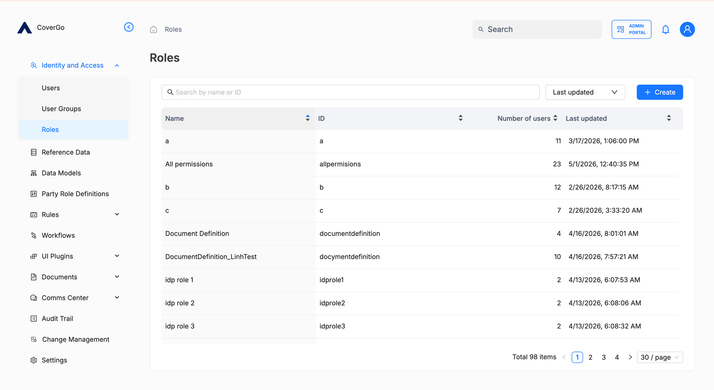
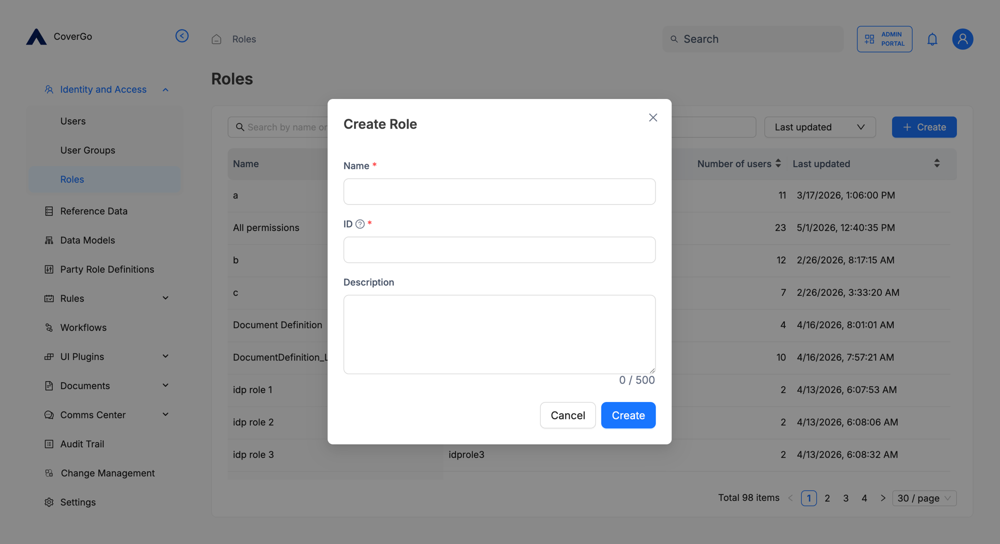
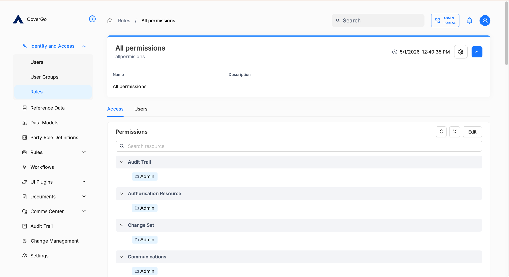
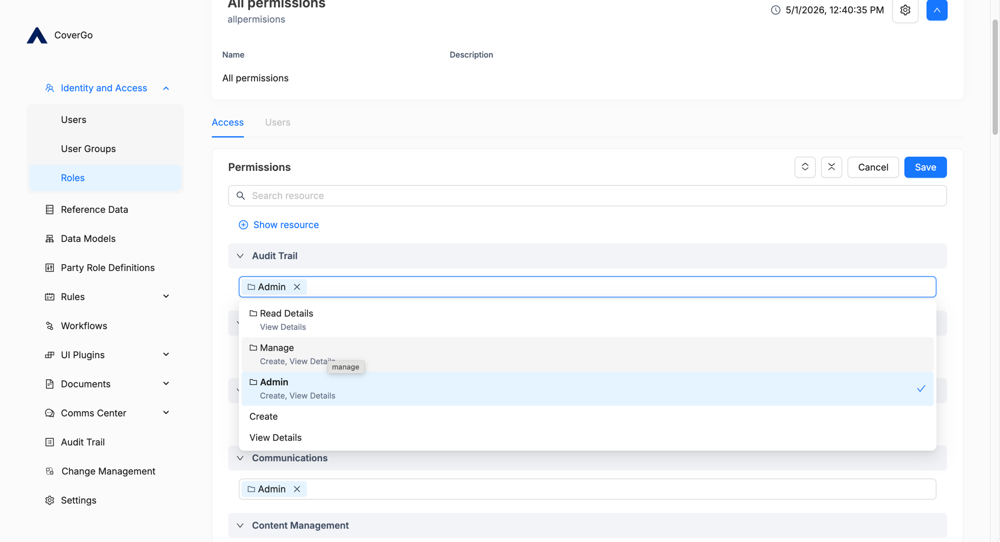
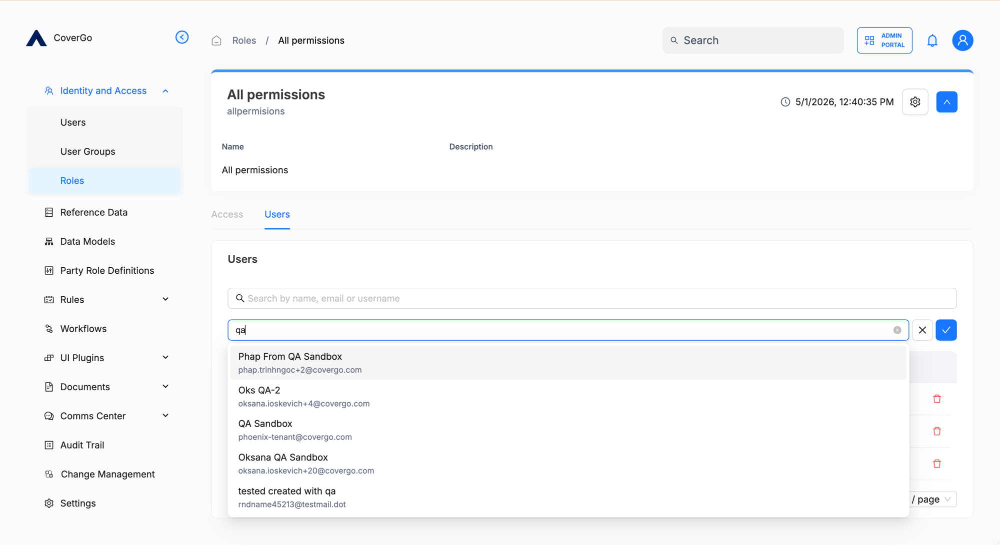

# Roles

A **role** is a named bundle of permissions that you assign to users or [user groups](user-groups.md) to grant them everything the bundle covers. Roles let you describe access in business terms — "Claims handler", "Read-only auditor" — instead of picking individual permissions every time.

Roles are managed in **Identity and Access → Roles**. Every role you see in the list is one an administrator created.

## Key concepts

- **Role.** A named bundle of permissions. The same role can be assigned to many users and many user groups.
- **ID.** A short, stable identifier you choose when creating the role (e.g. `claims-handler`, `read-only-auditor`). Used in audit logs and integrations; matched against the `roles` claim during [identity-provider role sync](authentication/identity-providers.md#how-role-sync-works).
- **Permissions on a role.** A role's access is described as a set of selections per [authorisation resource](authorisation-resources.md) — for example, the `manage` group on `User` plus the `readonly` group on `Document`.

## How to find a role

1. Open **Identity and Access → Roles**.
2. Type a name or ID into the search box. The list filters as you type.
3. Sort by **Last updated** to find recently changed roles, or by **Number of users** to find heavily used ones.
4. Click any row to open that role's detail page.

## How to create a role

1. On the Roles list, click **+ Create**. The **Create Role** dialog opens.
2. Fill in:
    - **Name** — a human-readable name. Shown wherever the role is referenced.
    - **ID** — the stable identifier. Lowercase, no spaces (e.g. `claims-handler`).
    - **Description** — optional; up to 500 characters.
3. Click **Create**.

The new role opens with no permissions assigned yet. Continue with [How to assign permissions to a role](#how-to-assign-permissions-to-a-role).

## How to view a role

1. Open **Identity and Access → Roles** and click the role.
2. The detail page has two tabs:
    - **Access** — the role's permissions, grouped by [authorisation resource](authorisation-resources.md).
    - **Users** — the users this role is directly assigned to.

## How to assign permissions to a role

A role's access is built up resource by resource. For each [authorisation resource](authorisation-resources.md) you want the role to grant access to, pick a permission group (or one or more individual permissions) on that resource.

1. Open the role's detail page.
2. On the **Access** tab, click **Edit** in the **Permissions** card. The fields become editable.
3. Click **Show resource** to add a new resource. The resource picker opens with the list of available resources.
4. Pick the resource you want to grant access to.

    

5. Click into the dropdown next to the resource and choose a permission group (e.g. `Manage`, `Read Only`, `Admin`) or one or more individual permissions.

    

6. Repeat for every resource the role should cover. Remove a resource by clicking the **×** next to its row.
7. Click **Save**.


**Picking a permission group is usually the right call.** Permission groups (`readonly`, `manage`, `admin`) are curated bundles of the permissions an admin most often grants together. Picking individual permissions makes sense only when you need finer control than the groups provide.


## How to assign a role to users

1. Open the role's detail page → **Users** tab.
2. Click **Add**. A search field opens.
3. Type the user's name, email, or username. Pick from the dropdown.
4. Click the confirmation checkmark.

The user appears in the table immediately, and the role is now part of their effective access.

You can also assign a role to a user from the user's own detail page — see [Users › How to assign roles and user groups](users.md#how-to-assign-roles-and-user-groups). Both routes have the same effect.

To remove a user from the role, click the **×** (trash icon) at the end of the row.

## How to update a role

- **Name and description** — open the role and use the gear icon at the top right.
- **ID** — not editable after creation.
- **Permissions** — see [How to assign permissions to a role](#how-to-assign-permissions-to-a-role).
- **User assignments** — see [How to assign a role to users](#how-to-assign-a-role-to-users).

## How to delete a role

1. Open the role's detail page.
2. Click the gear icon at the top right.
3. Choose **Delete** and confirm.

Deleting a role removes it from every user and user group it was assigned to. Their access drops accordingly the next time they sign in (or sooner — see [Sessions](authentication/sessions.md)).

<!-- TODO: add screenshot of the gear-icon menu on a role's detail page showing the Delete action. -->

## Reference

### Fields

| Field | What it is | Required | Editable later |
| --- | --- | --- | --- |
| **Name** | Human-readable name. | Yes | Yes |
| **ID** | Stable identifier (lowercase, no spaces). | Yes | No |
| **Description** | Free-form description, up to 500 characters. | No | Yes |

### Permissions

What an administrator can do with roles depends on which permission group they hold on the `Role` authorisation resource:

| Action | `readonly` | `manage` | `admin` |
| --- | --- | --- | --- |
| List roles | ✓ | ✓ | ✓ |
| View a role | ✓ | ✓ | ✓ |
| Create a role | | ✓ | ✓ |
| Update a role's name and description | | ✓ | ✓ |
| Update a role's permissions | | ✓ | ✓ |
| Assign or unassign users on a role | | | ✓ |
| Delete a role | | | ✓ |

## Troubleshooting

<strong>I removed a permission from a role, but a user with the role still seems to have it.</strong>

The user might be getting that permission from somewhere else — another role assigned directly, or a user group they're in that carries it. Open the user's detail page to see all assigned roles and user groups, and check each.

<strong>I deleted a role and now several users have lost access.</strong>

Expected. Deleting a role removes it from every user and user group it was assigned to. If the deletion was a mistake, recreate the role and reassign the same permissions and users.

