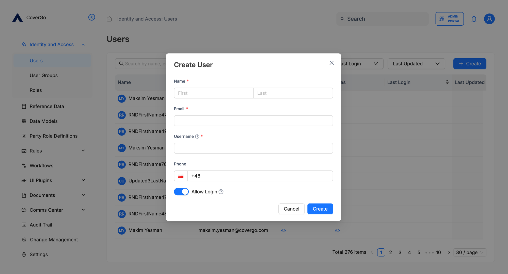
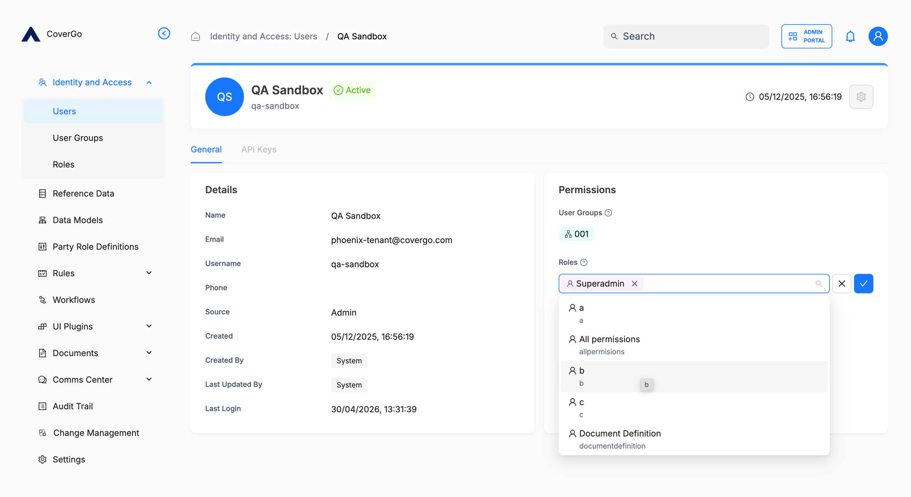
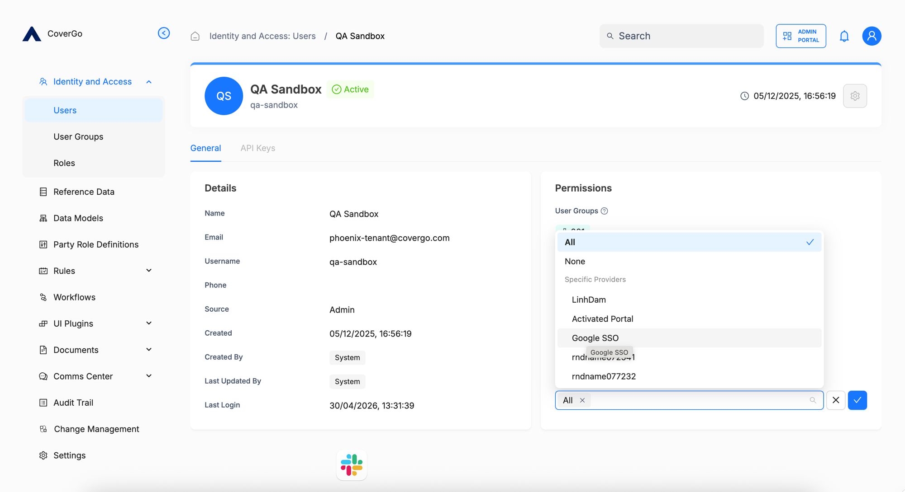
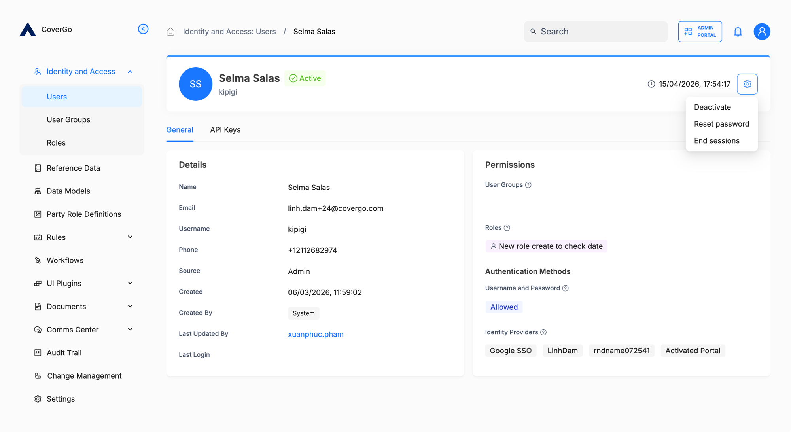
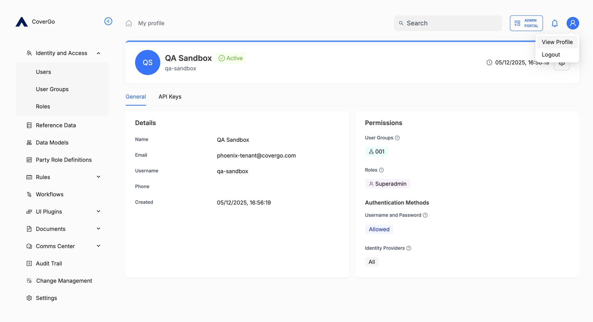

# Users

A user is an account that can sign in to the platform — either a person or a system. Administrators create users, control what each one can do by assigning **roles** and **user groups**, and deactivate them when access should end. Users can also view their own profile and sign out from any portal.

Users are managed in **Identity and Access → Users**. Every user has a status that controls whether they can sign in, an email and username for sign-in, and a complete record of every action they take.

## Key concepts

- **Status.** One of three:
    - **Pending** — the account exists but the user hasn't verified their email yet. They cannot sign in.
    - **Active** — verified. They can sign in.
    - **Deactivated** — an administrator has revoked access. They cannot sign in until reactivated.
- **Suspension.** An automatic 30-minute lock that prevents an Active user from signing in after five failed password attempts. It's independent of status — a suspended user is still **Active**, just blocked from signing in.
- **Source.** How the user record was created. Either **Admin** (created in the UI by an administrator) or **IdP** (auto-created on first sign-in via an external identity provider — see [Identity Providers](authentication/identity-providers.md)).
- **Authentication methods.** Which sign-in methods this specific user is allowed to use. By default a user can sign in with any method the platform supports; an administrator can restrict a user to fewer methods, or to none at all.

## How to find a user

1. Open **Identity and Access → Users**.
2. Type a name, email, or username into the **search** box at the top of the list. The list filters as you type.
3. Sort by **Last Login** or **Last Updated** to find recently active or recently changed users.
4. Click any row to open that user's detail page.

## How to create a user

1. Open **Identity and Access → Users**.
2. Click **+ Create**. The **Create User** dialog opens.
3. Fill in the fields:
    - **Name** — the user's first and last name.
    - **Email** — the user's email address. Must be unique on the platform; the activation message is sent here.
    - **Username** — the user's sign-in handle. Defaults to the part of the email before the `@`. The user can sign in with either their username or their email.
    - **Phone** — optional, with country code.
4. Decide the **Allow Login** toggle:
    - **On** (default) — the user can sign in with username and password and via any configured identity provider. The platform sends them an activation email straight away.
    - **Off** — the user is created with all sign-in methods blocked. No activation email is sent. Use this for **API users** — accounts that exist only to own [API keys](authentication/api-keys.md) for an integration.
5. Click **Create**.

The new user appears in the list. With **Allow Login** on, they're in **Pending** status until they verify their email; once verified, they move to **Active**. With **Allow Login** off, they're created in **Active** status with no sign-in possible — only API key access.


**Most fields are fixed after creation.** Only the user's **name** can be edited later — email, username, and phone are set at creation and can't be changed. Pick them carefully up front.


## How to assign roles and user groups

A user's access is controlled by the **roles** and **user groups** assigned to them. Both compose — a user has the union of permissions from every role and every group they're in.

1. Open the user's detail page.
2. In the **Permissions** panel on the right of the **General** tab, click into the **User Groups** field and pick the groups the user should belong to. Click an existing pill to remove a group.
3. Click into the **Roles** field and pick the roles to assign. Click an existing pill to remove a role.

Changes save inline — there's no separate **Save** button.

For more on the building blocks themselves, see [Roles](authorisation/roles.md) and [User Groups](authorisation/user-groups.md).

## How to restrict how a user signs in

By default, a user can sign in with any method the platform supports — username and password, or any configured identity provider. You can restrict an individual user to fewer methods, all the way to none.

1. Open the user's detail page.
2. In the **Authentication Methods** panel on the right of the **General** tab, adjust:
    - **Username and Password** — switch from **Allowed** to disallowed if the user must sign in only via an identity provider.
    - **Identity Providers** — switch from **All** to a specific subset, or block entirely.
3. Changes save inline.

If you set **Username and Password** to disallowed *and* **Identity Providers** to none, the user cannot sign in at all. This is the **API user** pattern — an account that exists only to own [API keys](authentication/api-keys.md) for an integration. New users created with the **Allow Login** toggle off start in this configuration.

## Admin actions

Click the gear icon at the top-right of the user detail page to open the admin actions menu. The actions you see depend on the user's current status.

- **Reset password.** Triggers the standard password-reset email — the user receives a link, clicks it, and sets a new password. Available when the user has password sign-in allowed.
- **Deactivate.** Available when the user is **Active**. Sets the status to **Deactivated** — the user immediately cannot sign in, and existing sessions are ended.
- **Activate.** Available when the user is **Deactivated**. Returns the user to **Active**.
- **End sessions.** Ends every active portal session the user has — the next time they open a portal, they'll be sent to the sign-in screen. Confirms before acting.
- **Unsuspend.** Available when the user is currently suspended (the automatic lock after five failed sign-in attempts). Clears the lock immediately rather than waiting the 30 minutes. The user's status is unchanged — only the suspension is lifted.

## API keys

Each user can have **API keys** — credentials an external system uses to authenticate to the API as that user. They're managed on the user's **API Keys** tab.

For details, see [API keys](authentication/api-keys.md).

## Your own profile

Click the user icon at the top-right of any portal screen and choose **View Profile** to open your own user page. You'll see your name, email, username, the user groups and roles you have, and the authentication methods available to you.

You can edit your **first and last name** from this page. The rest is read-only — ask an administrator if anything else needs changing.

## Reference

### Fields

| Field | What it is | Required | Editable later |
| --- | --- | --- | --- |
| **Name** | First and last name. | Yes | Yes |
| **Email** | The user's email address. Must be unique on the platform. The activation message is sent here. | Yes | No |
| **Username** | The user's sign-in handle. Defaults to the part of the email before the `@`. Can be used to sign in instead of the email. | Yes | No |
| **Phone** | The user's phone number, with country code. | No | No |
| **Allow Login** | Whether the user can sign in with any method when the account is created. **Off** creates an API-only user. | No (defaults to on) | — |

### Statuses

| Status | What it means | How a user gets here | How they leave |
| --- | --- | --- | --- |
| **Pending** | Account created; awaiting email verification. | Created via **+ Create** with **Allow Login** on. | Verifies their email, or signs in via an identity provider. |
| **Active** | Verified and able to sign in. | Verifies email, signs in via an identity provider, or an administrator reactivates a deactivated user. | An administrator deactivates the user. |
| **Deactivated** | Sign-in revoked by an administrator. | Administrator clicks **Deactivate** in the gear menu. | Administrator clicks **Activate** in the gear menu. |

### Suspension

Suspension is a separate, temporary lock that applies on top of an `Active` user's status — it doesn't replace it.

| What triggers it | Effect | What clears it |
| --- | --- | --- |
| Five failed password attempts in a row. | The user can't sign in until the lock clears. Their status remains `Active` throughout. | Automatic, 30 minutes after the lock began; or a successful password reset; or an administrator clicks **Unsuspend** in the gear menu. |

### Permissions

What an administrator can do with users depends on which permission group they hold on the `User` authorisation resource:

| Action | `readonly` | `manage` | `admin` |
| --- | --- | --- | --- |
| View a user | ✓ | ✓ | ✓ |
| List users | ✓ | ✓ | ✓ |
| Create a user | | ✓ | ✓ |
| Update a user | | ✓ | ✓ |
| Resend the verification email | | ✓ | ✓ |
| Reset a user's password | | ✓ | ✓ |
| Activate / Deactivate a user | | | ✓ |
| Unsuspend a user | | | ✓ |
| End a user's sessions | | | ✓ |
| Manage a user's API keys | | | ✓ |

See [Roles](authorisation/roles.md) for how to grant an administrator one of these permission groups.

## Troubleshooting

<strong>The user didn't receive their activation email.</strong>

Check that **Allow Login** was on when the user was created — if it was off, no email is sent. If it was on, ask the user to check their spam folder. As an administrator with the right permissions on Users, you can also [resend the verification email](authentication/activate-account.md#how-to-resend-the-verification-email-administrators) or reset the user's password to issue a fresh activation flow.

<strong>The user can't sign in.</strong>

Open the user's detail page and check the status badge:

- **Pending** — they haven't verified their email yet. Resend the verification email or reset their password.
- **Deactivated** — an administrator revoked their access. Click **Activate** in the gear menu to restore it.

If the status is **Active**, check whether the user is currently **suspended** (the automatic 30-minute lock after five failed password attempts). The gear menu's **Unsuspend** action is only available when they are; clicking it clears the lock immediately. You can also wait the 30 minutes, or trigger a password reset (which clears the suspension too).

If the user is Active and not suspended, check the **Authentication Methods** panel — they may be restricted to a sign-in method they're not actually using (for example, restricted to identity providers only when they're trying with a password).

<strong>I clicked End sessions, but the user can still see the platform.</strong>

Active sessions are ended immediately, but a user already mid-action may complete what they had in flight for a few minutes after. The next time they navigate or refresh, they'll be sent to the sign-in screen.

